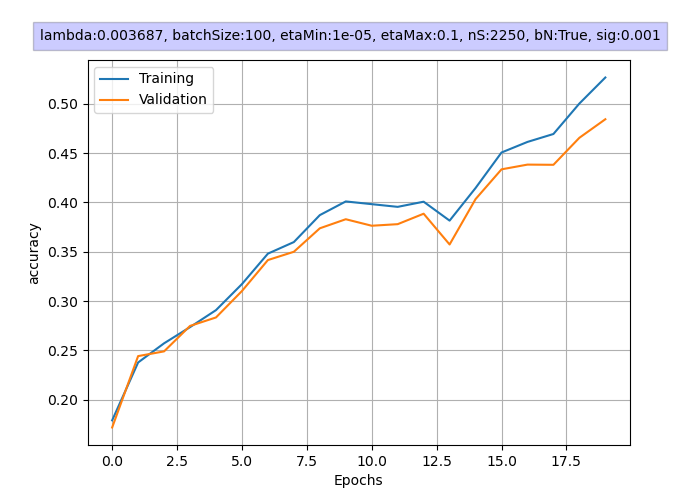
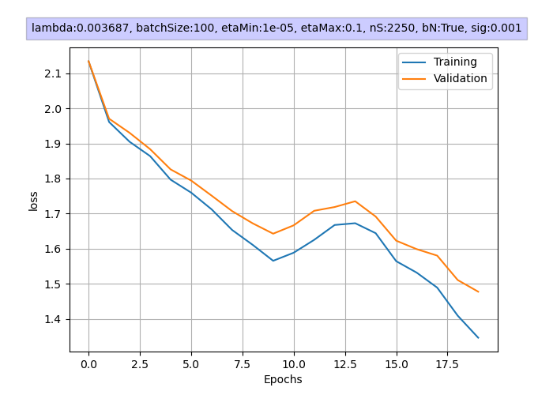

# CIFAR-Image-Classifier-From-Scratch
A CIFAR10 Multi-Layer Image Classifier, made from scratch in Python where everything from the cost function to the backpropagation algorithm is implemented by hand and without support libraries to fully understand the neural network architecture. The goal was to implement a neural network that could accurately classify images of 10 different objects from the standardized CIFAR10 dataset.

## Modules Implemented by hand
- Back-propagation Algorithm 
- Gradient Descent Algorithm
- Cost and Loss Function
- Batch Normalisation
- Model Evaluation
- Image preprocessing and encoding

## Model Performance

To test the performance of the network, it was trained during 20 epochs with the following hyperparamters:
- Lambda: .003687 (found through hyperparamter grid search) 
- etaMin = 1e-5, etaMax = 1e-1
- nS=2250
- Batch Size: 100

**The best performing model achieved a 54,8% validation accuracy and a 53,9% test accuracy** and its development can be seen in the graphs below.

  
 
